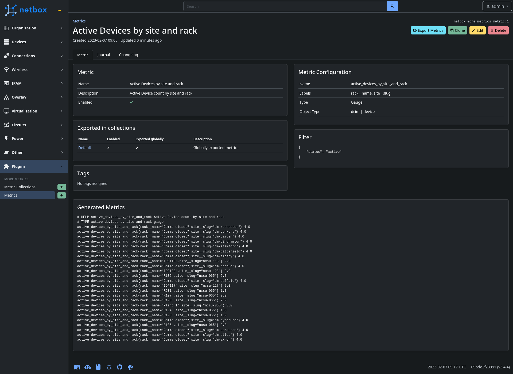
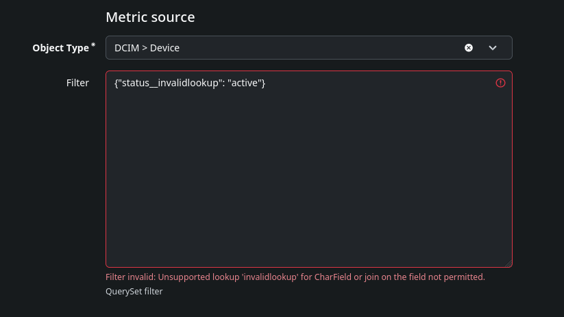

# netbox-more-metrics

Create custom metrics and export information from NetBox into your timeseries database.

## Compatibility

| NetBox Version | Plugin Version |
|----------------|----------------|
|     3.4        |      0.1.0     |

## Installing

For adding to a NetBox Docker setup see
[the general instructions for using netbox-docker with plugins](https://github.com/netbox-community/netbox-docker/wiki/Using-Netbox-Plugins).


### Install

```bash
pip install netbox-more-metrics
```

or by adding to your `local_requirements.txt` or `plugin_requirements.txt` (netbox-docker):

```bash
netbox-more-metrics
```

### Development Install

If you would like to install a version not yet published to pypi.

```bash
pip install git+https://github.com/TheDJVG/netbox-more-metrics
```

or by adding to your `local_requirements.txt` or `plugin_requirements.txt` (netbox-docker):

```bash
git+https://github.com/TheDJVG/netbox-more-metrics
```

### NetBox Configuration

Enable the plugin in `/opt/netbox/netbox/netbox/configuration.py`,
 or if you use netbox-docker, your `/configuration/plugins.py` file :

```python
PLUGINS = [
    'netbox_more_metrics'
]
```


## Features
### Custom metrics
For example, you could track the amount of active devices over time by rack and site


Any model can be exported, data is grouped by the labels.

### Filter validation
Every filter is tested on save and also when the metric is initiated for exporting.


### Heavy lifting is done by the database
As much as possible is done in the database directly to take advantage of any Model specific optimizations.

`null` database values are converted to a string `"null"`.

# Functions
- Metrics can be included in the global metric endpoint (`/metrics`).
- Metrics and MetricCollections can be individually exported (as long as the Metric(Collection) is enabled)

# Future ideas
- Adding a way to export utilization (e.g. how many IPs of a prefix are used, or how much power is still available on a feed).

**More ideas welcome!**

# Missing
- Tests
- Documentation
